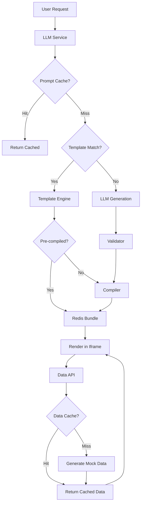

# Remove Appsmith & Build Native Spark Component Library

## Current State Analysis

Spark currently has:

- **SolidJS microapp engine** (LLM → validate → compile → render in iframe)
- **Mock data generator** with 5 rich profiles (ecommerce, saas, marketing, finance, sales)
- **Redis caching** for compiled bundles (code_hash → bundle)
- **Appsmith integration** (docker container, service, proxy, frontend support)
- **Performance tracking** (request-to-render timing already in place)

## Overview

This plan will remove all Appsmith dependencies and build a native Spark component system that can generate beautiful AI insights in <30 seconds through:

1. **Component library** (pre-built templates + reusable primitives)
2. **Catalog system** (save/reuse/compose generated components)
3. **LLM prompt caching** (avoid regenerating similar components)
4. **Aggressive data caching** (Redis-based query results)
5. **Pre-compilation** of common patterns

---

## Phase 1: Remove Appsmith (Clean Slate)

### Backend Cleanup

Remove Appsmith-related files and integrations:

**Files to delete:**

- [`backend/app/services/appsmith_service.py`](backend/app/services/appsmith_service.py) (384 lines)
- [`backend/app/routers/appsmith_proxy.py`](backend/app/routers/appsmith_proxy.py) (134 lines)

**Files to modify:**

- [`backend/app/main.py`](backend/app/main.py) - Remove appsmith_proxy router import and registration (line 46)
- [`backend/app/routers/chat.py`](backend/app/routers/chat.py) - Remove:
  - `appsmith_service` import (line 24)
  - `_APPSMITH_SAFE_PATH_DEFAULT` and related sanitization functions (lines 26-81)
  - All `appsmith_app` type handling in `/message` and `/message/stream` endpoints (lines 263-288, 514-538)
- [`backend/app/services/llm.py`](backend/app/services/llm.py) - Remove `appsmith_app` mode from system prompt and response handling (lines 22, 48-67, 260-272)
- [`backend/app/config.py`](backend/app/config.py) - Remove appsmith_* settings (lines 20-28)

### Frontend Cleanup

**Files to delete or gut:**

- [`frontend/src/components/MicroappIframe.tsx`](frontend/src/components/MicroappIframe.tsx) - Remove all Appsmith support (lines 3, 12-27, 32, 37, 40-44, 78)
- [`frontend/src/components/ComponentsView.tsx`](frontend/src/components/ComponentsView.tsx) - Remove Appsmith paths logic (lines 20-24, 76, 86-111, 126-137)

**Type updates:**

- `frontend/src/types/index.ts` - Remove `appsmithPath` and `MicroappKind` type (keep only `spark_component`)

### Docker Cleanup

- [`docker-compose.yml`](docker-compose.yml) - Remove:
  - `appsmith` service (lines 14-19)
  - `APPSMITH_*` environment variables from backend service (lines 35-40)
  - `appsmith_stacks` volume (line 51)

### Database Cleanup

Create migration to remove `appsmith_path` and `microapp_kind` columns:

```sql
-- supabase/migrations/YYYYMMDD_remove_appsmith.sql
ALTER TABLE chat_messages DROP COLUMN IF EXISTS appsmith_path;
ALTER TABLE chat_messages DROP COLUMN IF EXISTS microapp_kind;
```

---

## Phase 2: Component Library System

### 2.1 Pre-Built Component Templates

Create a library of optimized, pre-compiled component templates that the LLM can reference or compose.

**New file:** `backend/app/component_library/templates.py`

Templates to build:

1. **StatCard** - KPI cards with trend indicators
2. **DataTable** - Filterable, sortable tables with pagination
3. **LineChart** - Time series charts (Chart.js or ApexCharts)
4. **BarChart** - Comparison charts
5. **PieChart** - Distribution charts
6. **MetricsDashboard** - Multi-stat overview with cards
7. **FilterPanel** - Reusable filter controls
8. **ListWithSearch** - Searchable lists with categories

Each template will be:

- Pre-written optimized SolidJS code
- Pre-validated
- Pre-compiled and cached
- Parameterized (LLM fills in data fields, titles, etc.)

**New file:** `backend/app/component_library/primitives.py`

Reusable SolidJS hooks and utilities:

- `useDataFetch` - Standard data fetching pattern
- `useFilter` - Client-side filtering logic
- `useSort` - Sorting logic
- `formatCurrency`, `formatDate`, `formatNumber` - Formatting helpers
- `chartConfigs` - Pre-configured Chart.js/ApexCharts configs

### 2.2 Template Engine

**New file:** `backend/app/services/template_engine.py`

Responsible for:

1. **Template selection** - Match user prompt to best template(s)
2. **Template composition** - Combine multiple templates
3. **Parameter injection** - Fill template placeholders with user-specific data
4. **Hybrid generation** - Use templates when possible, full LLM generation when needed
```python
class TemplateEngine:
    def match_templates(self, user_prompt: str) -> List[ComponentTemplate]
    def compose_from_templates(self, templates: List, params: dict) -> str
    def should_use_template(self, user_prompt: str) -> bool
```


### 2.3 Component Catalog System

**Database schema addition:**

```sql
-- supabase/migrations/YYYYMMDD_component_catalog.sql
CREATE TABLE component_templates (
  id UUID PRIMARY KEY DEFAULT gen_random_uuid(),
  tenant_id UUID NOT NULL,
  name TEXT NOT NULL,
  description TEXT,
  category TEXT, -- 'chart', 'table', 'card', 'dashboard', 'custom'
  tags TEXT[], -- searchable tags
  solidjs_code TEXT NOT NULL,
  code_hash TEXT NOT NULL,
  compiled_bundle TEXT,
  is_public BOOLEAN DEFAULT false, -- share across tenants
  usage_count INTEGER DEFAULT 0,
  created_at TIMESTAMPTZ DEFAULT NOW(),
  updated_at TIMESTAMPTZ DEFAULT NOW()
);

CREATE INDEX idx_templates_tenant_category ON component_templates(tenant_id, category);
CREATE INDEX idx_templates_tags ON component_templates USING GIN(tags);
```

**New router:** `backend/app/routers/catalog.py`

Endpoints:

- `GET /api/catalog/templates` - List available templates
- `GET /api/catalog/templates/{id}` - Get template details
- `POST /api/catalog/templates` - Save a component as a template
- `POST /api/catalog/templates/{id}/use` - Use template (increment usage count)

---

## Phase 3: LLM Prompt Caching

### 3.1 Semantic Prompt Cache

**New file:** `backend/app/services/prompt_cache.py`

```python
class PromptCache:
    """
    Cache LLM responses based on semantic similarity of prompts.
    Avoids regenerating components for similar requests.
    """
    
    async def get_cached_response(self, prompt: str, profile: str) -> Optional[ChatResponse]
    async def cache_response(self, prompt: str, profile: str, response: ChatResponse)
    def compute_prompt_hash(self, prompt: str, profile: str) -> str
```

**Caching strategy:**

1. Normalize prompt (lowercase, remove punctuation, extract key terms)
2. Hash normalized prompt + profile context
3. Store in Redis with TTL (e.g., 24 hours)
4. Key format: `llm:prompt:{hash}` → JSON response

**Cache key generation:**

```python
def compute_prompt_hash(self, prompt: str, profile: str) -> str:
    # Extract key terms: chart types, metrics, data profiles
    normalized = self._normalize_prompt(prompt)
    combined = f"{profile}:{normalized}"
    return hashlib.sha256(combined.encode()).hexdigest()[:16]
```

### 3.2 Integration with LLM Service

Modify [`backend/app/services/llm.py`](backend/app/services/llm.py):

```python
async def generate_response(self, user_message: str, conversation_history: List[Dict]) -> ChatResponse:
    # 1. Check prompt cache
    cached = await self.prompt_cache.get_cached_response(user_message, "general")
    if cached:
        logger.info("Prompt cache hit")
        return cached
    
    # 2. Check if template can be used
    if self.template_engine.should_use_template(user_message):
        response = await self.template_engine.generate_from_template(user_message)
        await self.prompt_cache.cache_response(user_message, "general", response)
        return response
    
    # 3. Fall back to LLM generation
    response = await self._generate_with_llm(user_message, conversation_history)
    await self.prompt_cache.cache_response(user_message, "general", response)
    return response
```

---

## Phase 4: Data Caching Layer

### 4.1 Mock Data Caching

**Modify:** [`backend/app/routers/components.py`](backend/app/routers/components.py) - `/data` endpoint (lines 384-496)

Add Redis caching for mock data:

```python
@router.post("/{component_id}/data")
async def get_component_data(component_id: str, request: Request, body: dict = None):
    # Generate cache key from mock spec
    mock_req = (body or {}).get("mock")
    if mock_req:
        cache_key = f"mock:{mock_req['profile']}:{mock_req['scale']}:{mock_req['seed']}:{mock_req['days']}"
        
        # Check cache
        redis = await get_redis()
        cached_data = await redis.get(cache_key)
        if cached_data:
            return json.loads(cached_data)
        
        # Generate and cache
        spec = MockSpec(...)
        data = generate_mock_dataset(spec)
        await redis.setex(cache_key, 3600, json.dumps(data))
        return data
```

### 4.2 Query Result Caching

For real data sources (when integrated), cache query results:

```python
cache_key = f"query:{hash(sql_query)}:{params_hash}"
```

---

## Phase 5: Pre-Compilation & Optimization

### 5.1 Pre-Compile Common Templates

**New script:** `backend/scripts/precompile_templates.py`

At deployment time:

1. Load all built-in templates
2. Pre-compile with esbuild
3. Store compiled bundles in Redis with long TTL
4. Components using templates can skip compilation entirely

### 5.2 Bundle Size Optimization

**Modify:** [`backend/app/services/compiler.py`](backend/app/services/compiler.py)

1. Add tree-shaking configuration
2. Use external dependencies (solid-js, chart.js via CDN)
3. Target smaller bundle sizes (<5KB for simple components)
```javascript
{
  "bundle": true,
  "minify": true,
  "treeShaking": true,
  "external": ["solid-js", "solid-js/web", "chart.js"],
  "format": "iife"
}
```


### 5.3 Enhanced System Prompt

**Modify:** [`backend/app/services/llm.py`](backend/app/services/llm.py) system prompt

Add component library reference:

```
Available Pre-Built Templates (use when appropriate):
- StatCard: For single KPI metrics with trend
- DataTable: For tabular data with filters/sort
- LineChart: For time series trends
- BarChart: For comparisons
- MetricsDashboard: For multi-stat overview

When user request matches a template, prefer composing from templates rather than generating from scratch.

Example template usage:
// Use StatCard template
import { StatCard } from '@spark/templates';
export default function() {
  return <StatCard title="Revenue" value={data.revenue} trend="+12%" />
}
```

---

## Phase 6: Performance Monitoring & Refinement

### 6.1 Enhanced Metrics

**Modify:** [`backend/app/routers/chat.py`](backend/app/routers/chat.py)

Add cache hit tracking:

```python
metrics = {
    "event": "micro_app_created",
    "cache_strategy": "bundle_hit" | "prompt_hit" | "template_used" | "llm_generated",
    "timing": {...},
    "optimization_score": bundle_size / target_size
}
```

### 6.2 Target Performance Goals

- **LLM generation:** <3s (with caching)
- **Compilation:** <1s (with caching: 0ms)
- **Data fetch:** <500ms (with caching: <50ms)
- **Render:** <500ms
- **Total end-to-end:** <5s (ideal), <30s (acceptable)

---

## Phase 7: Enhanced LLM Prompt

Update the system prompt to guide the LLM toward using best practices:

```
IMPORTANT OPTIMIZATION RULES:
1. Prefer built-in templates when possible (faster, smaller)
2. Use mock data profile that matches the user's domain
3. Keep components focused and small (< 100 lines, < 10KB compiled)
4. Use DaisyUI for styling (no custom CSS)
5. Always use createResource for data fetching

Data profile selection:
- E-commerce: products, orders → profile: 'ecommerce'
- SaaS: MRR, churn, retention → profile: 'saas'
- Marketing: campaigns, attribution → profile: 'marketing'
- Finance: P&L, transactions → profile: 'finance'
- Sales: pipeline, opportunities → profile: 'sales'
```

---

## Implementation Order (Priority)

### High Priority (P0)

1. ✅ Remove all Appsmith code (Phase 1)
2. ✅ Build pre-built templates (Phase 2.1)
3. ✅ Implement LLM prompt caching (Phase 3)
4. ✅ Add data caching layer (Phase 4.1)

### Medium Priority (P1)

5. ✅ Build template engine (Phase 2.2)
6. ✅ Create catalog system (Phase 2.3)
7. ✅ Pre-compile templates (Phase 5.1)

### Lower Priority (P2)

8. Bundle optimization (Phase 5.2)
9. Performance monitoring (Phase 6)
10. Enhanced system prompt (Phase 7)

---

## Success Metrics

- ⚡ **<30s end-to-end** generation time (target: <5s with caching)
- 📦 **<10KB average bundle size** (down from current ~50KB)
- 🎯 **>80% cache hit rate** for similar prompts
- 🚀 **0ms compilation time** for template-based components
- 💎 **Beautiful, production-ready UIs** using DaisyUI + best practices

---

## Key Files to Create

New files:

1. `backend/app/component_library/__init__.py`
2. `backend/app/component_library/templates.py`
3. `backend/app/component_library/primitives.py`
4. `backend/app/services/template_engine.py`
5. `backend/app/services/prompt_cache.py`
6. `backend/app/routers/catalog.py`
7. `backend/scripts/precompile_templates.py`
8. `supabase/migrations/YYYYMMDD_remove_appsmith.sql`
9. `supabase/migrations/YYYYMMDD_component_catalog.sql`

---

## Architecture Diagram



---

This plan will transform Spark into a blazing-fast, Appsmith-free microapp engine with a comprehensive component library and aggressive caching strategy.